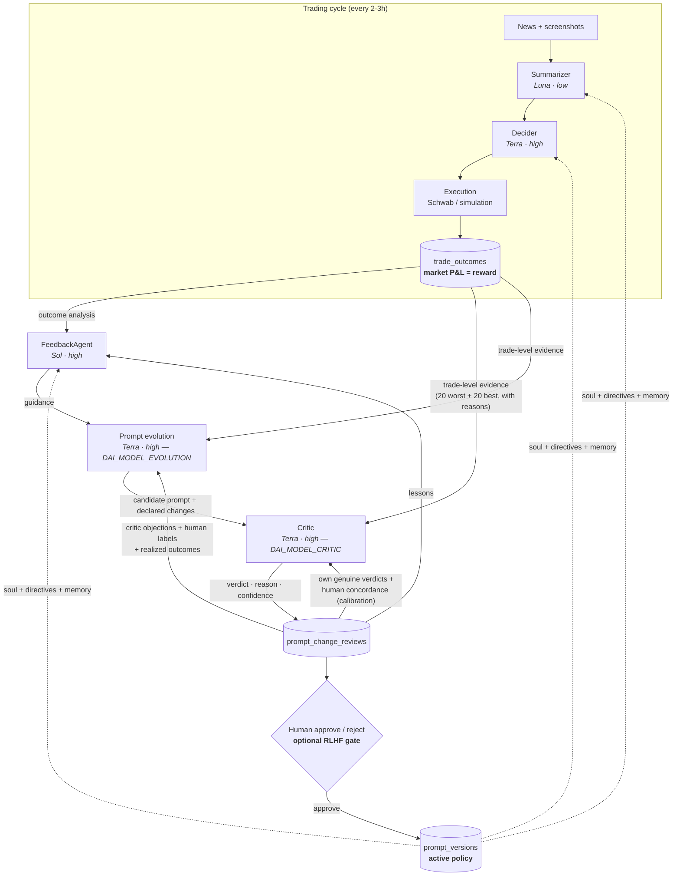

# 🤖 D-AI-Trader

An autonomous trading system built as a reinforcement-learning loop in which **the market is the reward signal**. Frozen LLM agents read financial news, decide trades, and execute them through the Schwab API (or in simulation); a feedback agent then scores the realized P&L and rewrites the agents' prompts. The policy that improves over time is **natural-language text — agent identity, strategy, and memory — not network weights.**

We call this **RLMF — Reinforcement Learning from Market Feedback** ([detailed below](#how-it-learns-rlmf)). It's the actual point of the project; the trading is the environment it learns in, not a get-rich scheme. Treat it as a research harness for prompt-space policy iteration.

Loop: `news → summarize → decide → execute → score → rewrite the prompt`. Default cadence is 3 hours, suited to 1–3 day holds on cash accounts (T+1 settlement). Runs fully in simulation with no broker required.

---

## How It Learns: RLMF

The system is a reinforcement-learning loop with two deliberate substitutions from the textbook setup:

- The **reward** is realized trade P&L — *the market itself*. No human rater (as in RLHF) and no learned reward model. The environment hands back ground truth.
- The **policy** is a block of prompt text — each agent's `SOUL` (identity), `STRATEGY DIRECTIVES` (evolving rules), and `MEMORY` (lessons) — injected into the system prompt at runtime. The LLM weights stay frozen. Learning happens in *text space*.

An **episode** is one trading cycle. A **policy update** is the feedback agent reading recent outcomes, attributing them to the reasons the Decider gave, and rewriting the prompt. Updates are human-readable diffs, gated by an approve/reject step in the Prompt Lab.

The policy is also kept as a **knowledge graph**: every prompt version is decomposed into one Markdown guideline per file (`agents/<agent>/policy-graph/<config>/v<N>/*.md` + `edges.json`), in the RUSH layout, and compiles back to the stored prompt byte-for-byte. The **Policy Graph** tab renders it as a force graph — rules, lessons, identity, code-owned blocks and memory rows as nodes; hierarchy, links, overlaps and "code constrains rule" as edges — with a version timeline so you can watch the policy evolve. The loop edits the graph directly: it proposes patches of at most three guideline files, the critic judges each file's diff, you approve per guideline, and the Decider cites the guideline ids that drove each decision, so every rule gets its own realized win rate. See [docs/POLICY_GRAPH.md](docs/POLICY_GRAPH.md).

```
        policy = prompt (soul + strategy directives + memory)
                              │
                              ▼
   Decider acts ──→ trade executes ──→ market resolves P&L ──→ Feedback agent
        ▲                                  (the reward)         scores outcomes,
        │                                                       rewrites the policy
        └──────────────── new prompt version ◀────────────────────────┘
```

### Compared to PPO

Same control loop, different machinery at every joint:

| | PPO | RLMF (this system) |
|---|---|---|
| **Policy** | Network weights θ | Prompt text (soul + directives + memory) |
| **Reward** | Environment scalar | Realized market P&L — no human, no learned reward model |
| **Update rule** | Gradient ascent on a clipped surrogate objective | An LLM rewrites the prompt from an outcome post-mortem |
| **Update space** | Continuous (weight deltas) | Discrete (natural language) |
| **Credit assignment** | Advantage / GAE over timesteps | Feedback agent ties P&L back to the stated trade rationale |
| **Stability mechanism** | Trust region / clip ratio | Versioned prompts + human approve/reject gate |
| **Sample regime** | Many on-policy rollouts | Few episodes; semantic generalization across them |
| **Interpretability** | Opaque weight deltas | Every update is a readable prompt diff |

PPO's clip exists to stop one update from moving the policy too far. The Prompt Lab's **approve/reject gate is the same idea** — a human-sized trust region on a textual policy step.

The trade-off is honest: a gradient learner needs thousands of noisy episodes to extract signal from financial returns, but assigns credit rigorously. RLMF can generalize from a handful — *"stop buying gap-ups into earnings"* is one sentence, not ten thousand gradient steps — but its credit assignment is coarse and only as good as the feedback agent's reasoning. **Garbage reward in, garbage policy out**: if outcomes are mislabeled, the loop learns nothing (see the dollar-delta fix in the changelog).

### Where it lives in the code

| Concept | Implementation |
|---|---|
| Policy | `prompt_versions` table (`soul` / `strategy_directives` / `memory`), injected at runtime as `## AGENT IDENTITY`, `## STRATEGY DIRECTIVES`, `## LESSONS FROM EXPERIENCE` |
| Policy as a graph | `policy_graph/` + `agents/<agent>/policy-graph/…/v<N>/*.md` — one guideline per file, same bytes as the row; `/policy-graph` tab; proposals in `policy_graph_proposals`; citations in each decision's reason (`[cites: DA.…]`) |
| Reward | `trade_outcomes.gain_loss_percentage` + `outcome_category` |
| Policy update | `feedback_agent.py` — weekly outcome analysis → prompt rewrite |
| Trust-region gate | Prompt Lab approve/reject (`/prompt-evolution`); per-guideline approve on the Policy Graph tab (`/policy-graph`) |
| Episode | One trading cycle (Summarizer → Decider → execution → outcome) |

### The Critic & the (optional) Human Gate

Policy updates are not shipped blind. Every Prompt Lab batch runs a three-stage
review, and **every verdict feeds back into the next round** — the loop learns
even when no human ever clicks:



How the learning signal flows:

- **Critic-only learning (no clicks needed).** Every candidate's verdict, reason,
  and confidence land in `prompt_change_reviews` and are injected into the *next*
  generation and feedback runs as `past_review_verdicts` — a candidate that repeats
  a rejected pattern without addressing the objection is told it will be rejected
  again. Human review is a bonus label, not a dependency.
- **Evidence, not vibes.** Generation and the critic both receive per-trade rows
  (worst 20 + best 20 closed trades, with entry/exit reasoning and a self-declared
  coverage statement). Proposals must cite tickers; the critic *verifies* claims
  against the same rows instead of rejecting for lack of data.
- **Human RLHF labels (optional).** An approve/reject click stamps
  `human_verdict` and `human_agrees_critic`. Concordance is only computed against
  *genuine* critic judgments — heuristic auto-rejects and critic outages record
  `critic_auto` / confidence 0 and are excluded, so downtime can never read as
  "the human overrode the critic."
- **Anti-sycophancy guardrails.** The critic calibrates only on a consistent
  pattern (3+ same-direction human overrides among genuine verdicts), and realized
  `winrate_delta` — measured after a shipped change has lived in the market —
  outranks human concordance. Labeled rows are kept in the learning window ahead
  of pending ones.
- **Fail-closed trust region.** Cosmetic-only candidates are auto-rejected without
  an LLM call; a critic outage defers to the human as a low-confidence reject.

Per-batch cost is dominated by the three generation calls, not the critic
(estimates at high reasoning, one click = 1 feedback + 3 generation + up to 3
critic calls):

| Configuration | Feedback | Generation ×3 | Critic ×3 | ~Total/batch |
|---|---|---|---|---|
| All Sol | $0.22 | ~$0.93 | ~$0.41 | **~$1.55** |
| Sol + Sol generation + Terra critic | $0.22 | ~$0.93 | ~$0.16 | **~$1.30** |
| Sol + **Terra generation** + Terra critic ⭐ default | $0.22 | ~$0.37 | ~$0.16 | **~$0.75** |
| Terra critic at *medium* effort | — | — | ~$0.10 | saves ~$0.06 |

Keep reasoning at **high** throughout the learning loop: the entire high→medium
saving across all seven calls is ~$0.20/batch, while candidate and verdict
quality are the loop's ceiling — one sloppy shipped prompt costs more than a
year of effort savings. The analysis brain (feedback) stays on Sol because
credit assignment is the step everything downstream consumes; generation and
judging run Terra, which benches within ~1 point of Sol on reasoning.

All knobs live in `.env`: `DAI_MODEL_FEEDBACK` / `DAI_MODEL_EVOLUTION` /
`DAI_MODEL_CRITIC` and `DAI_FEEDBACK_REASONING_LEVEL` / `DAI_CRITIC_REASONING_LEVEL`.
Every call is metered in `api_usage` (model, tokens, cost) per agent.

### Is it actually beating the market?

Win rate and raw % return can both look healthy while an index fund quietly
wins, so the Feedback tab's **System vs Market** panel benchmarks the account
against **SPY, DJIA, NASDAQ, and VTI** over the same window (`benchmark_tracker.py`,
`/api/feedback/benchmarks`):

- **Time-weighted return (TWR)** — deposits/withdrawals are pulled from the
  Schwab transactions API into `external_cash_flows` and stripped from the
  growth curve, so moving money in or out never reads as trading skill.
  Attribution is settlement-aware (a transfer dated Tuesday often posts to
  account value Wednesday); clustered transfers are resolved jointly against
  the value series.
- **Benchmark closes** are cached daily in `benchmark_history` via yfinance
  (dividend-adjusted for the ETFs). Override the lineup with
  `DAI_BENCHMARK_SYMBOLS` in `.env`.
- **Headline stats:** alpha vs SPY, Sharpe (system vs SPY), max drawdown
  (system vs SPY), plus trade-quality metrics the equity curve can't show —
  profit factor ($ won / $ lost), expectancy per trade, and payoff ratio
  (avg win % / avg loss %). Expectancy > 0 with payoff ≥ ~1.3 means the loop's
  risk-discipline lessons are landing even before alpha turns positive.
- Flowless one-day V-shapes from the (since-fixed) settled-cash snapshot bug
  are auto-filtered at read time and disclosed in the panel footnote.
- **Model-switch annotations** — the config hash stays fixed across model
  upgrades, so decider model changes (GPT-5.4 → GPT-5.5 → Terra, …) are logged
  to `model_transitions` at each decision-cycle start
  (`decider_agent.record_model_transition`) and drawn as dashed vertical lines
  on the chart. That makes "did the new brain change the curve?" readable at
  a glance; the footnote shows the full model chain for the window.

---

## Quick Start

### Prerequisites

| Requirement | Notes |
|---|---|
| Python 3.12+ | 3.14 tested |
| PostgreSQL 17 | Optional — falls back to SQLite |
| Chrome 141+ | Headless scraping |
| OpenAI API key | Required |
| Schwab API creds | Only for live trading |

### 1. Clone & Configure

```bash
git clone <repo-url>
cd d-ai-trader
cp env_template.txt .env
# Edit .env — at minimum set OPENAI_API_KEY
```

### 2. Database (optional)

```bash
brew install postgresql@17 && brew services start postgresql@17
export PATH="/opt/homebrew/opt/postgresql@17/bin:$PATH"
createdb adobi
# Add to .env:
#   DATABASE_URI=postgresql://$(whoami)@localhost/adobi
python init_database.py
```

Skip this and the app boots on SQLite automatically.

### 3. Run in Simulation

```bash
# Default 3-hour cadence, GPT-5.4
./start_d_ai_trader.sh -p 8080 -t simulation -c 180

# Faster loops for experimentation
./start_d_ai_trader.sh -p 8080 -t simulation -c 60
./start_d_ai_trader.sh -p 8080 -t simulation -c 15
```

The launcher auto-creates a virtualenv and installs dependencies on first run.

**Dashboard:** http://localhost:8080

---

## 🧠 Agent Soul & Memory

Each trading agent has a persistent **Soul** (identity/philosophy) and **Memory** (learned lessons).

### File Structure

```
agents/
├── decider/
│   ├── SOUL.md      # Trading philosophy, risk rules, decision style
│   └── MEMORY.md    # Lessons learned from trading experience
├── summarizer/
│   ├── SOUL.md      # Extraction philosophy, signal priorities
│   └── MEMORY.md    # Source quality notes, extraction patterns
└── feedback/
    └── SOUL.md      # Review philosophy, feedback style
```

### Policy graph (guidelines as a knowledge graph)

Every prompt version is also a folder of Markdown guideline files plus `edges.json`, RUSH-style,
under `agents/<agent>/policy-graph/<config_hash>/v<N>/`, and the dashboard's **Policy Graph** tab
renders it as a force graph with a version timeline, per-guideline history, citations and health.
The repository ships the baseline in `agents/<agent>/policy-graph/baseline/v0/` — the v0 policy
every fresh checkout starts from — and `init_database.py` writes your own config's v0 next to it.
Versions v1… are the evolution on your machine (weekly feedback, Prompt Lab, and proposals the
loop drafts as guideline-file patches for you to approve). See `docs/POLICY_GRAPH.md`.

### How It Works

- **Soul** defines *who the agent is* — personality, philosophy, decision-making style. Loaded from `agents/<name>/SOUL.md` as defaults, stored in DB, editable in Prompt Lab.
- **Memory** captures *what the agent has learned* — patterns, mistakes, lessons. Auto-updated by the feedback agent after each analysis cycle.
- Both are injected into the system prompt at runtime:
  - `## AGENT IDENTITY` — soul content
  - `## STRATEGY DIRECTIVES` — evolving strategy
  - `## LESSONS FROM EXPERIENCE` — memory content

### Editing

- **Prompt Lab UI**: Edit soul and memory directly in the dashboard
- **File override**: Set `DAI_SOUL_FILE_OVERRIDE=1` to load from `agents/` files instead of DB
- **Database**: Soul and memory are stored in the `prompt_versions` table (`soul` and `memory` columns)

### Memory Management

- Memory auto-grows as the feedback agent adds lessons after each cycle
- Compressed when exceeding ~4000 chars (~1000 tokens): oldest entries archived, most recent kept
- Append-only with automatic compression — no data loss, just summarization

### Backwards Compatibility

Empty soul/memory fields are fully backwards compatible — agents behave exactly as before until content is added.

---

## Architecture

```
Summarizer  →  Momentum Recap  →  Decider  →  Execution  →  Feedback
(6 sources)    (scorable view)    (LLM)       (sim/Schwab)  (weekly RLMF)
```

### Pipeline Detail

```
              Every cadence cycle (first at market open 6:30 AM PT)
                                │
                                ▼
                   ┌─────────────────────┐
                   │     Summarizer      │
                   │  6 news sources →   │
                   │  screenshot + GPT   │
                   └──────────┬──────────┘
                              │
                              ▼
                   ┌─────────────────────┐
                   │   Momentum Recap    │
                   └──────────┬──────────┘
                              │
                              ▼
                   ┌─────────────────────┐
                   │      Decider        │
                   │  BUY / SELL / HOLD  │
                   └──────────┬──────────┘
                              │
                              ▼
                   ┌─────────────────────┐
                   │   Decision Validator│
                   │  (guardrails)       │
                   └──────────┬──────────┘
                              │
                              ▼
                   ┌─────────────────────┐
                   │  Execution Layer    │
                   │  simulation │ Schwab│
                   └──────────┬──────────┘
                              │
                              ▼
                   ┌─────────────────────┐
                   │  Feedback Agent     │
                   │  (weekly → rewrites │
                   │   the prompt/policy)│
                   └─────────────────────┘
```

### Core Modules

| File | Purpose |
|---|---|
| `d_ai_trader.py` | Main orchestrator + scheduler |
| `main.py` | News scraping & screenshot analysis |
| `decider_agent.py` | Trading decision engine |
| `decision_validator.py` | Financial guardrails — prevents hallucinated trades |
| `feedback_agent.py` | Post-close performance analysis |
| `config.py` | Model config, env loading, DB setup |
| `dashboard_server.py` | Flask web UI + API |
| `schwab_client.py` | Schwab API integration |
| `schwab_streaming.py` | Real-time Level-One quotes + account activity |
| `schwab_ledger.py` | Shadow ledger for unsettled cash tracking |
| `trading_interface.py` | Unified sim/live trading layer |
| `safety_checks.py` | Multi-layer safety manager |
| `prompt_manager.py` | Prompt versioning & evolution |
| `shared/market_clock.py` | Market hours utility |
| `shared/run_context.py` | Run context propagation |
| `shared/ticker_normalize.py` | Consistent ticker handling |

---

## Configuration

### `.env` Reference

```bash
# Required
OPENAI_API_KEY=sk-proj-your_key_here

# Global model (fallback for anything without a per-agent override; also -m flag)
DAI_GPT_MODEL=gpt-5.6-terra

# Per-agent model overrides (aliases work: sol / terra / luna)
DAI_MODEL_SUMMARIZER=gpt-5.6-luna   # frequent vision calls — budget tier
DAI_MODEL_COMPANY=gpt-5.6-luna      # ticker/entity extraction
DAI_MODEL_DECIDER=gpt-5.6-terra     # the trade brain
DAI_MODEL_FEEDBACK=gpt-5.6-sol      # weekly policy updates — flagship
DAI_MODEL_CRITIC=gpt-5.6-terra      # prompt-change reviewer (defaults to feedback model)
DAI_MODEL_EVOLUTION=gpt-5.6-terra   # candidate generation (defaults to feedback model)

# Database (optional — falls back to SQLite)
DATABASE_URI=postgresql://$(whoami)@localhost/adobi

# Account type
IS_MARGIN_ACCOUNT=0          # 0 = cash (default), 1 = margin ($25k+ only)

# Trading
TRADING_MODE=simulation      # simulation | live
MAX_POSITION_VALUE=2000      # Per-position floor ($)
MAX_POSITION_FRACTION=0.33   # Per-position fraction of account
MAX_TOTAL_INVESTMENT=10000   # Total invested capital floor ($)
MAX_TOTAL_INVESTMENT_FRACTION=0.95
MIN_CASH_BUFFER=500          # Minimum cash reserve ($)
DAI_MAX_TRADES=4             # Max trades per cycle (buys + sells)
DAI_MODEL_TEMPERATURE=0.3

# Reasoning levels (light | low | medium | high | xhigh | max*)  *GPT-5.6 only
DAI_SUMMARIZER_REASONING_LEVEL=low
DAI_DECIDER_REASONING_LEVEL=high
DAI_FEEDBACK_REASONING_LEVEL=high
DAI_CRITIC_REASONING_LEVEL=high

# Schwab API (for live trading)
SCHWAB_CLIENT_ID=your_client_id
SCHWAB_CLIENT_SECRET=your_client_secret
SCHWAB_ACCOUNT_HASH=your_account_hash
SCHWAB_REDIRECT_URI=https://127.0.0.1:5556/callback

# Optional
DAI_PROMPT_PROFILE=standard  # standard | gpt-pro
DAI_DECIDER_RAW_PREVIEW=4000 # Debug: chars of raw Decider output to print
```

### CLI Options

```
./start_d_ai_trader.sh [OPTIONS]

  -p, --port PORT            Dashboard port (default: 8080)
  -m, --model MODEL          AI model (default: gpt-5.4)
  -v, --prompt-version VER   auto | vN (default: auto)
  -P, --prompt-profile PROF  standard | gpt-pro (default: standard)
  -t, --trading-mode MODE    simulation | live (default: simulation)
  -c, --cadence MINUTES      180 (default) | 60 | 30 | 15
```

### Supported Models

| Model | Use Case | $/1M in/out | Notes |
|---|---|---|---|
| **gpt-5.6-sol** ⭐ | Feedback / evolution | $5 / $30 | Flagship; alias `sol`, bare `gpt-5.6` → Sol |
| **gpt-5.6-terra** ⭐ | Decider, critic | $2 / $12 | Near-Sol reasoning at 40% of the price; alias `terra` (or `tera`) |
| **gpt-5.6-luna** ⭐ | Summarizer, extraction | $0.20 / $1.20 | Vision-capable budget tier; alias `luna` |
| **gpt-5.5** | Previous flagship | $5 / $30 | Same price as Sol, lower benchmarks |
| **gpt-5.4 / -mini** | Previous default | — / $0.75 / $4.50 | Still supported |
| **gpt-4o / 4o-mini** | Legacy | $2.50/$10 · $0.15/$0.60 | Non-reasoning fallbacks |

All GPT-5.x models accept a reasoning suffix on `-m` (e.g. `-m gpt-5.6-sol-max`,
`-m terra-high`); the suffix globally overrides the per-agent reasoning envs.
Rates live in `model_pricing.json` (re-read per request) and drive the
dashboard's per-agent cost tracking.

> o1/o3 models are **not** supported (no system messages or JSON mode).

---

## Trading Strategy

The strategy is not a claim about returns — it's the **initial policy** the RLMF loop starts from and then mutates. Everything below is the default `SOUL` + `STRATEGY DIRECTIVES`, and all of it is subject to being rewritten by the feedback agent as outcomes accumulate. Read it as starting conditions, not promises.

### Starting policy

- Short-swing horizon: 1–5 day holds, catalyst-driven entries
- Capital rotation: exit on thesis-break, redeploy into fresher setups
- Cash is a position: hold it when no setup clears the bar

### Default exit thresholds

| Condition | Action |
|---|---|
| ≥ +5% | Take profit |
| −3% to −5% | Stop loss |

These live in the strategy directives and drift over time as the loop learns; the dashboard always reflects the active version, not this table.

### Position sizing (default)

- Per trade: $1,500–$4,000
- Max concurrent positions: 5
- Cash buffer maintained at all times

### Account Types

- **Cash (default, `IS_MARGIN_ACCOUNT=0`)**: Buys use settled funds only. T+1 settlement means 1–3 day hold periods. The 3-hour cadence keeps you compliant with good-faith rules.
- **Margin (`IS_MARGIN_ACCOUNT=1`)**: Reuses same-day proceeds. Requires $25k+ to avoid PDT violations. Enables faster cadences (15–30 min).

---

## Schedule

| Time (PT) | Event |
|---|---|
| 6:30 AM | Market open — first cycle runs |
| 6:30 AM → 1:00 PM | Intraday cycles every `--cadence` minutes |
| 1:00 PM | Market close |
| Thursday 5:30 PM | Feedback agent runs the weekly policy update (RLMF) |
| After hours | Decisions recorded as "⛔ MARKET CLOSED", no execution |

The scheduler auto-runs a catch-up cycle if started after 6:30 AM PT. The feedback/prompt-evolution step is weekly by design — it needs a batch of closed trades to compute a meaningful reward signal — but can also be triggered on demand from the Prompt Lab.

---

## News Sources

| Source | Focus |
|---|---|
| Yahoo Finance (stock-market-news) | Stock news, earnings |
| StockAnalysis (gainers) | Intraday movers, day-trade catalysts |
| Fox Business | Market sentiment |
| AP Business | Clean, factual |
| BBC Business | International markets |
| CNBC | Breaking news, market movers |

Sources rot. Sites add paywalls, Cloudflare challenges, or just start returning 404/500 — when one does, the summarizer wastes a cycle on an error page, so the list in `main.py` (`URLS`) gets pruned and replaced periodically. The retired roster (Benzinga, MarketBeat, Reuters, TheStreet, Investing.com, MarketWatch, Finviz, TipRanks) is documented inline there.

---

## Dashboard

**Tabs:**

- **Dashboard** — Portfolio value, cash balance, P&L, interactive charts. Schwab card shows settled vs raw cash, funds-available components, margin indicator.
- **Trades** — All decisions with timestamps, tickers (linked to Yahoo Finance with chart popups), config-specific filtering.
- **Summaries** — Latest news analysis from all 6 sources, timestamped PT.
- **Feedback** — Win rate, average profit, trade outcomes, AI learning insights.
- **Schwab** — Live account balance, holdings, buying power, real-time sync.
- **Prompt Lab** — Interactive prompt evolution and testing.

Manual trigger buttons: Run Summarizer, Run Decider, Run Feedback, Run All Agents.

---

## Live Trading

### Step 1: Read-Only Schwab Test

```bash
./start_schwab_live_view.sh -p 8080
# Open http://localhost:8080/schwab
```

### Step 2: Single-Buy Pilot

```bash
./start_live_trading.sh --port 8080 --model gpt-5.4 --cadence 180
# Executes at most ONE buy per cycle
```

### Step 3: Full Automation

```bash
export DAI_MAX_TRADES=5
export DAI_SCHWAB_READONLY=0
./start_d_ai_trader.sh -p 8080 -t real_world -c 180
```

### OAuth & Token Management

```bash
# Manual OAuth flow
SCHWAB_CLIENT_ID=... SCHWAB_CLIENT_SECRET=... ./schwab_manual_auth.py --save

# Refresh existing token
SCHWAB_CLIENT_ID=... SCHWAB_CLIENT_SECRET=... ./schwab_manual_auth.py --refresh --save
```

> Schwab refresh tokens expire ~7 days. If you see `refresh_token_authentication_error`, delete `schwab_tokens.json`, re-run the OAuth flow via `./test_schwab_api.sh`, and restart.

### Streaming (Live Quotes)

```bash
# Auto-detect symbols from current positions
./run_schwab_streaming.py

# Custom watchlist
DAI_STREAM_SYMBOLS="SPY,AAPL,QQQ" ./run_schwab_streaming.py
```

The streaming helper maintains a shadow ledger so effective funds update immediately after fills. Launched automatically by `start_live_trading.sh`; add `--no-stream` to disable.

---

## Guardrails

### Decision Validator

- Cannot sell stocks you don't own
- Cannot buy stocks you already hold
- Enforces position size limits
- Validates tickers and amounts against current portfolio

### Multi-Layer Safety (Live)

1. `DAI_SCHWAB_READONLY` flag
2. `TRADING_MODE` must be `live`
3. Market hours enforcement
4. Decision validator approval
5. Safety manager checks

### Emergency Stop

```bash
pkill -f d_ai_trader.py
pkill -f dashboard_server.py
```

---

## Parallel Runs

Each configuration gets a unique `config_hash` — data is fully isolated:

```bash
# Terminal 1
./start_d_ai_trader.sh -p 8080 -m gpt-5.4 -t simulation -c 180

# Terminal 2 — different model, different port
./start_d_ai_trader.sh -p 8081 -m gpt-4o -t simulation -c 60
```

---

## Cost Estimate

### API Usage (default 3-hour cadence, GPT-4o pricing)

- 6 sources × 3 cycles/day ≈ 18 vision calls
- ~90K tokens/day
- **~$1/day** (~$30/month)

GPT-5.4 costs more per token but uses fewer cycles. Actual spend depends on cadence and model choice.

---

## Project Structure

```
d-ai-trader/
├── d_ai_trader.py              # Orchestrator + scheduler
├── main.py                     # News scraping
├── decider_agent.py            # Trading decisions
├── decision_validator.py       # Guardrails
├── feedback_agent.py           # Performance analysis
├── dashboard_server.py         # Web UI + API
├── config.py                   # Configuration
├── schwab_client.py            # Schwab API
├── schwab_streaming.py         # Live quotes
├── schwab_ledger.py            # Shadow ledger
├── trading_interface.py        # Unified trading layer
├── safety_checks.py            # Safety manager
├── prompt_manager.py           # Prompt versioning
├── init_database.py            # Schema setup
├── shared/
│   ├── market_clock.py         # Market hours utility
│   ├── run_context.py          # Run context propagation
│   └── ticker_normalize.py     # Ticker normalization
├── prompts/                    # Prompt templates
├── templates/                  # Flask HTML templates
├── static/                     # Frontend assets
├── tests/                      # Test suite
├── screenshots/                # Captured news screenshots
├── start_d_ai_trader.sh        # Main launcher
├── start_live_trading.sh       # Live trading launcher
├── start_schwab_live_view.sh   # Read-only Schwab viewer
├── .env                        # Local config (not committed)
└── env_template.txt            # .env template
```

---

## Documentation

| File | Contents |
|---|---|
| `GO_LIVE_CHECKLIST.md` | Pre-flight safety checklist |
| `SCHWAB_API_SETUP.md` | Schwab API configuration |
| `SCHWAB_READONLY_TEST.md` | Safe broker testing |
| `FEEDBACK_SYSTEM.md` | AI learning system |
| `AUTOMATION_README.md` | Scheduling & automation |
| `SETUP_DEPENDENCIES.md` | Dependency setup |

---

## Troubleshooting

**ChromeDriver mismatch** — System auto-detects Chrome version and downloads the matching driver. Restart if you see version errors after a Chrome update.

**API key errors** — Check `.env` for stray characters (trailing `$`, extra quotes). Run with `PRINT_OPENAI_KEY=1` to see the masked key at startup.

**"MARKET CLOSED" decisions** — Normal outside 9:30 AM–4:00 PM ET (Mon–Fri). Decisions are recorded but not executed.

**Schwab token expired** — Delete `schwab_tokens.json`, re-run OAuth via `./test_schwab_api.sh`, restart.

---

## ⚠️ Disclaimer

Day trading is risky. You can lose money. This is experimental software for educational purposes. Start in simulation, test thoroughly, and never trade with money you can't afford to lose. This is not financial advice.

---

## Changelog

### June 2026
- **Reward-integrity fixes (the RLMF loop was learning from bad labels).** `break_even` was any trade within ±2%, so real −$6 to −$137 losses on small positions were labeled break-even and never reached the feedback agent as losses — categorization is now a dollar-delta test (`|net P&L| ≤ $3`). Backfilled 89/291 historical rows; the outcome distribution went from mostly-break_even to a truthful 128 loss / 121 win split.
- Fixed per-trade gain/loss % rendering ~100× too small (a stored fraction was displayed as a percent) across the Schwab Live, Feedback, and Prompt Lab tabs.
- Prompt Lab: one-click "refresh feedback + regenerate all agents" with per-agent diff tabs and approve/reject; background job + polling so progress survives navigation; instant Feedback↔Prompt Lab version sync.
- Added GPT-5.5 support and an `-m <model>-<effort>` reasoning suffix (e.g. `gpt-5.5-high`).
- Agent SOUL/MEMORY framework: committed `.default.md` seeds, gitignored live mirrors, Obsidian-ready memory format.
- macOS resilience: re-sign chromedriver after `undetected_chromedriver` patches it (Gatekeeper SIGKILL), Postgres.app permission-dialog workaround.

### March 2026
- Upgraded default model to GPT-5.4
- Frontend overhaul — premium fintech dark theme
- Added `init_database.py` for proper schema initialization
- Prompt Lab tab — interactive prompt evolution dashboard
- Extracted `MarketClock` utility + test suite
- Codebase cleanup (−450 lines)
- Centralized run context propagation
- Shared ticker normalization

### December 2025
- Prompt profile flag (`-P/--prompt-profile`)
- Trades tab: Yahoo Finance links + chart popups
- Schwab card: settled funds / raw cash / margin differentiation
- `DAI_DECIDER_RAW_PREVIEW` for raw output debugging
- Scheduler catch-up if started after market open

### October 2025
- GPT-4o Vision for screenshot analysis
- GPT-5 reasoning model support
- Configurable cadence (15/30/60/180 min)
- Financial guardrails (AI hallucination prevention)
- Config-isolated parallel runs
- 6 reliable news sources
- Schwab read-only testing mode
