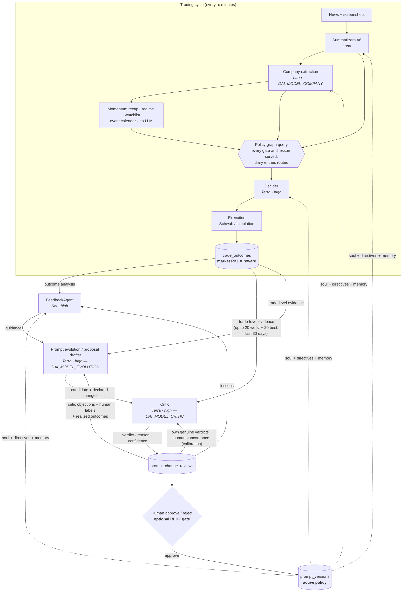

# 🤖 D-AI-Trader

An autonomous trading system built as a reinforcement-learning loop in which **the market is the reward signal**. Frozen LLM agents read financial news, decide trades, and execute them through the Schwab API (or in simulation); a feedback agent then scores the realized P&L and rewrites the agents' prompts. The policy that improves over time is **natural-language text — agent identity, strategy, and memory — not network weights.**

We call this **RLMF — Reinforcement Learning from Market Feedback** ([detailed below](#how-it-learns-rlmf)). It's the actual point of the project; the trading is the environment it learns in, not a get-rich scheme. Treat it as a research harness for prompt-space policy iteration. Its sibling project, **RUSH**, applies the same idea (a versioned policy graph of Markdown guidelines, edited one gated step at a time) to content judging, where the reward is expert labels instead of P&L. See [Next steps](#next-steps-rush-jev-and-model-routing).

Loop: `news → summarize → decide → execute → score → rewrite the prompt`. Cycles run every `-c` minutes during market hours (the live run uses 120), suited to 1–5 day holds on a cash account with T+1 settlement. It can also run in simulation without placing broker orders.

---

## How It Learns: RLMF

The system is a reinforcement-learning loop with two deliberate substitutions from the textbook setup:

- The **reward** is realized trade P&L — *the market itself*. No human rater (as in RLHF) and no learned reward model. The environment hands back ground truth.
- The **policy** is a block of prompt text — each agent's `SOUL` (identity), `STRATEGY DIRECTIVES` (numbered gates), and `MEMORY` (lessons and a dated diary) — injected into the system prompt at runtime. The LLM weights stay frozen. Learning happens in *text space*.

An **episode** is one trading cycle. A **policy update** is normally a new row in `prompt_versions`. The exceptions are that `init_database.py` re-syncs v0 to the code defaults at startup, and the first version saved after a reset to v0 overwrites v1. Four writers create versions:

| Writer | When | Gate |
|---|---|---|
| **Weekly feedback** (`feedback_agent.py`) | Thursday 20:30 ET | None. It replaces the `Latest Feedback Reminder` section of the directives with this week's 2 to 4 numbered gates, adds the same gates to memory as a dated diary entry, then activates the new version. |
| **Prompt Lab** (`/prompt-evolution`) | On demand | Generator, then critic verdict, then human approve or reject |
| **Policy-graph proposals** (`policy_graph/proposals.py`) | On demand | A patch of at most 3 guideline files, then critic per file, then human approval per guideline |
| **Operator versions** (`policy_graph/operator.py`) | By hand | Hand-authored patches get the same validation and critic record as a drafted proposal. Maintenance versions skip both and are labelled `maintenance` in their description and the activation log. |

Every activation by these writers goes through `prompt_manager.set_active_prompt_version` and is logged in `prompt_activation_events`, and the most recent batch can be undone from the Feedback tab. At startup `init_database.py` re-activates a dormant v0 directly, without a log entry.

**The policy is a knowledge graph.** Each prompt version is mirrored as one Markdown guideline per file plus `edges.json`, under `agents/<agent>/policy-graph/<config>/v<N>/`, in the RUSH layout. The directory is written the first time the version is read (by a Decider cycle, the Policy Graph tab or a proposal), and it compiles back to the stored row byte for byte. The `prompt_versions` row stays canonical; the graph is an exact, editable view of it. The **Policy Graph** tab shows three layers: **policy** (the `.md` guidelines compiled into the prompt), **prompt scaffold** (templates and code-owned text) and **cycle context** (memory rows and world factors such as the regime, FOMC, CPI and jobs windows, and earnings dates). Each gate reads as plain lines, and a version timeline shows the policy changing.

**How the Decider reads it.** Each cycle the Decider's soul, directives and memory are rebuilt from the active graph by a deterministic query, with no model call. Every gate, lesson and soul section is served every cycle; only dated diary entries are routed (by regime, held or watched tickers, news tickers, extracted companies, trend tickers, quarantine, recency and shared tags). Over the 30 days to 2026-10-02, about 40 guidelines were served per cycle and about 1 was dropped, roughly 4.7k tokens. That fits the prompt comfortably, so there is no LLM routing agent; the lever is pruning what is never cited. Each served guideline carries its id and record (`⟨id · cited 7d/30d/90d · win %⟩`), and every decision must cite 1 to 4 guideline ids, so each rule accumulates its own realized win rate.

**Decision paths.** The bottom of the Policy Graph tab draws *route or world factor → guideline cited → buy / sell / hold*, lists guidelines cited but never served (the query missed them) and served but never cited (dead weight), and scores each guideline over the closed trades that cited it. Details: [docs/POLICY_GRAPH.md](docs/POLICY_GRAPH.md), with the short form in [docs/POLICY_GRAPH_AND_ROUTING.md](docs/POLICY_GRAPH_AND_ROUTING.md) (also as `.docx`).

```
        policy = prompt (soul + strategy directives + memory), stored as a guideline graph
                              │
                              ▼
   Decider acts ──→ trade executes ──→ market resolves P&L ──→ Feedback agent
        ▲            (cites guideline ids)      (the reward)     scores outcomes,
        │                                                         rewrites the policy
        └──────────────── new prompt version ◀──────────────────────────┘
```

### Compared to PPO

Same control loop, different machinery at every joint:

| | PPO | RLMF (this system) |
|---|---|---|
| **Policy** | Network weights θ | Prompt text (soul + directives + memory) |
| **Reward** | Environment scalar | Realized market P&L — no human, no learned reward model |
| **Update rule** | Gradient ascent on a clipped surrogate objective | An LLM rewrites the prompt from an outcome post-mortem |
| **Update space** | Continuous (weight deltas) | Discrete (natural language) |
| **Credit assignment** | Advantage / GAE over timesteps | Guideline citations tie each decision's P&L to the rules it used |
| **Stability mechanism** | Trust region / clip ratio | One attributable change per step, critic gate, human approval, versioned prompts |
| **Sample regime** | Many on-policy rollouts | Few episodes; semantic generalization across them |
| **Interpretability** | Opaque weight deltas | Every update is a readable prompt diff |

PPO's clip exists to stop one update from moving the policy too far. The critic's doctrine is the textual version: approve only small, attributable, executable steps that target a measured leak (`policy_graph/prompts.py`). The weekly automatic path does not pass through that gate, which is worth remembering when reading a version's realized delta.

The trade-off is honest: a gradient learner needs thousands of noisy episodes to extract signal from financial returns, but assigns credit rigorously. RLMF can generalize from a handful — *"stop buying gap-ups into earnings"* is one sentence, not ten thousand gradient steps — but its credit assignment is coarse and only as good as the outcome labels. **Garbage reward in, garbage policy out** (see the June 2026 dollar-delta fix in the changelog).

### Where it lives in the code

| Concept | Implementation |
|---|---|
| Policy | `prompt_versions` (`soul` / `strategy_directives` / `memory`). The soul goes under `## AGENT IDENTITY`, the directives fill the system template's `{strategy_directives}` placeholder, and the memory goes under `## LESSONS FROM EXPERIENCE` |
| Policy as a graph | `policy_graph/` + `agents/<agent>/policy-graph/`; the `/policy-graph` tab; proposals in `policy_graph_proposals`; served and cited rows in `policy_graph_hits` / `policy_graph_runs` |
| Reward | `trade_outcomes.gain_loss_percentage` + `outcome_category` |
| Policy update | The four writers above |
| Trust-region gate | Critic doctrine + human approval (Prompt Lab, per-guideline approval on the Policy Graph tab) |
| Realized effect of a change | `backfill_version_outcomes.py` writes realized win-rate deltas into `prompt_change_reviews` after the Thursday job |
| Episode | One trading cycle (Summarizer → Decider → execution → outcome) |

### The Critic & the (optional) Human Gate

Prompt Lab batches and policy-graph proposals run a three-stage review, and recent verdicts feed back into the next round:


```mermaid
flowchart TB
    subgraph CYCLE["Trading cycle (every -c minutes)"]
        NEWS[News + screenshots] --> SUM[Summarizers ×6<br/><i>Luna</i>]
        SUM --> CO[Company extraction<br/><i>Luna — DAI_MODEL_COMPANY</i>]
        CO --> TR[Momentum recap · regime · watchlist<br/>event calendar · no LLM]
        SUM & CO & TR --> KG{{Policy graph query<br/>every gate and lesson served;<br/>diary entries routed}}
        KG --> DEC[Decider<br/><i>Terra · high</i>]
        DEC --> EXEC[Execution<br/>Schwab / simulation]
        EXEC --> OUT[(trade_outcomes<br/><b>market P&L = reward</b>)]
    end

    OUT -->|outcome analysis| FB[FeedbackAgent<br/><i>Sol · high</i>]
    FB -->|guidance| GEN[Prompt evolution / proposal drafter<br/><i>Terra · high — DAI_MODEL_EVOLUTION</i>]
    GEN -->|candidate + declared changes| CRITIC[Critic<br/><i>Terra · high — DAI_MODEL_CRITIC</i>]
    OUT -->|"trade-level evidence<br/>(up to 20 worst + 20 best, last 30 days)"| CRITIC
    OUT -->|trade-level evidence| GEN
    CRITIC -->|verdict · reason · confidence| REV[(prompt_change_reviews)]
    REV --> HUMAN{Human approve / reject<br/><b>optional RLHF gate</b>}
    HUMAN -->|approve| POL[(prompt_versions<br/><b>active policy</b>)]
    POL -.->|soul + directives + memory| SUM & CO & DEC & FB

    REV -->|"critic objections + human labels<br/>+ realized outcomes"| GEN
    REV -->|lessons| FB
    REV -->|"own genuine verdicts +<br/>human concordance (calibration)"| CRITIC
```

- **Review history.** Every verdict, reason and confidence lands in `prompt_change_reviews`. The 8 most recent rows, human-labeled first, go into the next Prompt Lab and proposal runs as `past_review_verdicts` and into the weekly feedback run as its review history. A candidate that repeats a rejected pattern without addressing the objection is told it will be rejected again. Because labeled rows sort first, an unclicked critic verdict stops reaching the next prompt once eight or more rows are labeled.
- **Evidence, not vibes.** Generation and the critic both receive per-trade rows: up to the 20 worst and 20 best trades closed in the last 30 days, each with its entry and exit reasons cut to 140 characters. Proposals must cite tickers; the critic verifies claims against the same rows.
- **Plain gates.** The drafter, the weekly feedback agent and the critic are all told to write rules in one shape: *"N. LABEL — IF one condition on a supplied field THEN one action. Otherwise next gate. Falsified if …"*, at most 240 characters. On policy-graph proposals a style lint (`proposals.style_check`) warns on gates over 300 characters, more than one IF, several parentheses, or a primary gate with no falsifier. The critic receives those warnings; the Policy Graph tab does not display them yet.
- **Human RLHF labels (optional).** An approve or reject stamps `human_verdict` and `human_agrees_critic`. Concordance is computed only against genuine critic judgments, so a critic outage never reads as a human override.
- **Anti-sycophancy guardrails.** The critic recalibrates only on a consistent pattern (3+ same-direction human overrides), and realized `winrate_delta` outranks concordance, read through the regime split because a change shipped into a falling tape shows a negative delta regardless of merit.
- **Fail-closed.** Cosmetic-only candidates are auto-rejected without an LLM call; a critic outage defers to the human as a low-confidence reject.

Keep reasoning at **high** throughout the learning loop: these calls are a small share of spend (see [Cost](#cost)), and candidate and verdict quality are the loop's ceiling.

### Is it actually beating the market?

Win rate and raw % return can both look healthy while an index fund quietly wins, so the Feedback tab's **System vs Market** panel benchmarks the account against **SPY, DJIA, NASDAQ, and VTI** over the same window (`benchmark_tracker.py`, `/api/feedback/benchmarks`):

- **Time-weighted return (TWR)** — deposits and withdrawals are pulled from the Schwab transactions API into `external_cash_flows` and stripped from the growth curve, so moving money in or out never reads as trading skill. Attribution is settlement-aware, and clustered transfers are resolved jointly against the value series.
- **Only this panel is flow-adjusted.** The Dashboard's headline Net Gain/Loss and the "Net Performance" chart are account value minus a fixed starting baseline, so a deposit currently shows up there as a gain. Per-trade win rate and P&L in `trade_outcomes` are unaffected.
- **Benchmark closes** are cached daily in `benchmark_history` via yfinance (dividend-adjusted for the ETFs). Override the lineup with `DAI_BENCHMARK_SYMBOLS`.
- **Headline stats:** alpha vs SPY, Sharpe, max drawdown, plus profit factor, expectancy per trade and payoff ratio.
- **Model-switch annotations.** Decider model changes are logged to `model_transitions` at each cycle start and drawn as dashed lines. The computed config hash includes only the global `-m` model, not per-agent keys such as `DAI_MODEL_DECIDER`, and the live run pins its hash with `-H`, so the history stays on one hash across Decider model upgrades.

---

## Quick Start

### Prerequisites

| Requirement | Notes |
|---|---|
| Python 3.10+ | The launcher prefers 3.11 or 3.10 and builds the `dai/` virtualenv |
| PostgreSQL | Needed in practice. A SQLite fallback exists, but several core tables use Postgres types (`JSONB`, `TEXT[]`). |
| Chrome | Headless scraping and screenshots |
| OpenAI API key | Required |
| Schwab API credentials | Only for live trading. `schwab-py` is installed either way, because the dashboard imports the Schwab client. |

### 1. Clone & configure

```bash
git clone <repo-url>
cd d-ai-trader
cp env_template.txt .env
# Edit .env — at minimum set OPENAI_API_KEY and DATABASE_URI
```

`.env` holds your keys and is gitignored. Never commit it.

### 2. Database

```bash
brew install postgresql@17 && brew services start postgresql@17
createdb adobi
# in .env:  DATABASE_URI=postgresql://<you>@localhost/adobi
```

The launcher runs `init_database.py` on every start; it creates and migrates the tables and seeds v0 prompts.

### 3. Run in simulation

```bash
./start_d_ai_trader.sh -p 8080 -t simulation -c 120 -m gpt-5.6-terra
```

The launcher creates the virtualenv, installs `requirements.txt` when it changes, starts the dashboard and the trader, and keeps the Mac awake with `caffeinate` while the trader runs. Without `-m` the launcher exports `gpt-5.6-terra` as the global model; the per-agent `DAI_MODEL_*` keys in `.env` still decide each agent's model.

**Pick your starting policy.** The repository ships two policy graphs per agent: the committed **baseline** (v0 = the code defaults) and **latest**, a copy of the active, learned policy the repo was last pushed with. A fresh config seeds its v0 from whichever you choose; the choice applies only the first time a config hash is seeded.

```bash
./start_d_ai_trader.sh -p 8080 -t simulation -s default   # start from the code defaults
./start_d_ai_trader.sh -p 8080 -t simulation -s latest    # start from the shipped learned policy
```

The same switch is the shell variable `DAI_POLICY_SEED=default|latest` (for example `DAI_POLICY_SEED=latest ./start_d_ai_trader.sh …`). A value in `.env` is ignored under the launcher, which exports its own. The initializer prints which seed it used.

**Dashboard:** http://localhost:8080

---

## 🧠 Agent Soul & Memory

Each agent has a **Soul** (identity and philosophy), **Strategy Directives** (numbered gates) and **Memory** (lessons, patterns, mistakes and a dated diary), stored in `prompt_versions` and injected into the system prompt at runtime.

```
agents/
├── decider/      SOUL.default.md · MEMORY.default.md · policy-graph/
├── summarizer/   SOUL.default.md · MEMORY.default.md · policy-graph/
├── company/      SOUL.default.md · MEMORY.default.md · policy-graph/
└── feedback/     SOUL.default.md · MEMORY.default.md · policy-graph/
```

- **`*.default.md`** are the committed seeds. `SOUL.md` and `MEMORY.md` are optional, hand-made local overrides of those seeds and are gitignored, since they can hold trade-specific lessons; nothing writes them, and the database is canonical. `DAI_SOUL_FILE_OVERRIDE=1` makes the Summarizer, Company extraction and Feedback agents read soul and memory from the files; the Decider's graph-assembled prompt still comes from the database.
- **`policy-graph/baseline/v0`** and **`policy-graph/latest/`** are tracked. `latest/` is refreshed when the active version is materialized: every cycle for the Decider, and for every agent right after any activation commits (weekly save, Prompt Lab apply, reset, undo, applied proposal), at trader startup and at the end of the Thursday job (`prompt_manager.refresh_latest_policy_graph`, best effort). Per-config history under `policy-graph/<config_hash>/v<N>/` stays local.
- **Memory compression** (`memory_compress.py`) runs with the weekly job. When memory passes 9,000 characters, the oldest diary entries are archived; the standing lesson sections are never trimmed.
- **Decider long-term memory.** Up to `DAI_MEMORY_LT_LIMIT` (default 14) active `decider_memory` rows are injected each cycle, held-ticker rows first, then by weight and recency, together with a working memory of the last 6 decision cycles. They appear as `DA.ltm.*` nodes in the cycle-context layer.
- **Editing.** Edit soul and memory in the Prompt Lab, or propose guideline patches from the Policy Graph tab.

---

## Architecture

One trading cycle. The four cycle agents (Summarizer, Company extraction, Decider, Feedback) each have their own soul, directives and memory in `prompt_versions` and their own folder under `agents/`; the Prompt Lab's critic and evolution calls have neither.

```
  news + screenshots (6 sources)
        │
        ▼
  Summarizers (6 per cycle, Luna)          → headlines + insights + "Watchlist:" per source
        │
        ▼
  Company extraction (Luna)                → listed companies + tickers, rolled up to the parent
        │
        ▼
  Momentum recap · INDEX REGIME line ·     → yfinance, no LLM: trend recap, RISK-ON / MIXED / RISK-OFF,
  contrarian watchlist · quarantine          pull-back candidates, names exited in the last 2 sessions
        │
        ▼
  Event calendar (no LLM)                  → EVENT CALENDAR block: date, sessions to FOMC / CPI / jobs,
        │                                    earnings dates of holdings + watchlist, event-risk score 0–100
        ▼
  Policy graph query (no LLM)              → soul + directives + memory rebuilt from the active graph,
        │                                    each guideline tagged ⟨id · cited 7d/30d/90d · win %⟩
        ▼
  Decider (Terra · high)                   → decisions with cited guideline ids
        │
        ▼
  Profit-take guardrail → citation repair pass → validator → whole-share sizing within settled funds
        │                                                      → execution (Schwab / sim)
        │
        ▼
  trade_outcomes (the reward) → Feedback agent (Sol · high, weekly RLMF)
```

### Core modules

| File | Purpose |
|---|---|
| `d_ai_trader.py` | Orchestrator and scheduler |
| `main.py` | News scraping and screenshot summaries |
| `decider_agent.py` | Decision engine; also hosts company extraction, the momentum recap and execution sizing |
| `contrarian_screener.py` | INDEX REGIME line and the pull-back watchlist (yfinance, no LLM) |
| `event_calendar.py` | FOMC / CPI / jobs calendars, NYSE sessions, earnings dates, event-risk score, per-cycle snapshots |
| `order_sizing.py` | Whole-share sizing: a sub-share ticket rounds up to one share within the MAX rail and settled funds |
| `decision_validator.py` | Financial guardrails against hallucinated trades |
| `decider_memory.py` / `memory_compress.py` | Decider long-term memory rows; weekly diary compression |
| `feedback_agent.py` / `feedback_diagnostics.py` | Weekly outcome analysis; population diagnostics (regime, extension, re-entry, kill kind, event windows) |
| `prompt_manager.py` | Prompt versions and the audited activation switchboard |
| `prompt_outcome_attribution.py` / `backfill_version_outcomes.py` | Realized effect of each prompt change, for the critic scorecard |
| `benchmark_tracker.py` | System vs Market TWR with cash flows removed |
| `policy_graph/` | The guideline graph: decompose / compile / store, assembly (routing), citations, proposals, operator versions, decision paths, world factors |
| `dashboard_server.py` | Flask web UI and API |
| `trading_interface.py` / `schwab_client.py` / `schwab_ledger.py` | Live execution layer, Schwab API, shadow ledger of effective funds |
| `safety_checks.py` | Position and total-investment caps (see [Guardrails](#guardrails) for where they apply) |
| `init_database.py` / `initialize_prompts.py` | Schema setup and v0 prompts |
| `config.py` | Env loading, models, reasoning levels, database setup |
| `shared/` | Market clock, run context, ticker normalization, news context for decisions |

---

## Configuration

### `.env` reference

Key names with code defaults where one exists. Model values shown are the live run's choices, not code defaults: an unset per-agent key uses the global model. Your values live in `.env`.

Under `start_d_ai_trader.sh`, the launcher exports `DAI_GPT_MODEL` (from `-m`, default `gpt-5.6-terra`), `TRADING_MODE` (from `-t`) and `DAI_POLICY_SEED` (from `-s`), so those three `.env` values only apply when the Python entry points run directly.

```bash
# Required
OPENAI_API_KEY=
# Database: defaults to postgresql://<you>@localhost/<you> (DATABASE_URL also accepted);
# falls back to SQLite (d_ai_trader.sqlite3) if Postgres is unreachable
DATABASE_URI=

# Models: global fallback (also -m) and per-agent overrides (aliases: sol / terra / luna)
DAI_GPT_MODEL=
DAI_MODEL_SUMMARIZER=gpt-5.6-luna
DAI_MODEL_COMPANY=gpt-5.6-luna
DAI_MODEL_DECIDER=gpt-5.6-terra
DAI_MODEL_FEEDBACK=gpt-5.6-sol
DAI_MODEL_CRITIC=gpt-5.6-terra      # defaults to the feedback model
DAI_MODEL_EVOLUTION=gpt-5.6-terra   # defaults to the feedback model
DAI_DECIDER_FALLBACK_MODEL=gpt-4.1  # asked again when a GPT-5 Decider returns an empty [] or {}
DAI_MODEL_TEMPERATURE=0.2

# Reasoning levels (light | low | medium | high | xhigh | max*)  *GPT-5.6 only
DAI_SUMMARIZER_REASONING_LEVEL=     # default medium
DAI_COMPANY_REASONING_LEVEL=        # default low
DAI_DECIDER_REASONING_LEVEL=        # default high
DAI_FEEDBACK_REASONING_LEVEL=       # default high
DAI_CRITIC_REASONING_LEVEL=         # default high

# Account and mode
TRADING_MODE=simulation             # simulation | real_world ("live" is accepted as an alias)
IS_MARGIN_ACCOUNT=0                 # 0 = cash account (settled funds only)

# Ticket rails shown to the Decider; the validator enforces MIN and MAX, TYPICAL is guidance
DAI_MIN_BUY_AMOUNT=1000
DAI_TYPICAL_BUY_LOW=2000
DAI_TYPICAL_BUY_HIGH=3500
DAI_MAX_BUY_AMOUNT=4000             # also the ceiling for the one-share round-up
MIN_CASH_BUFFER=500                 # cash floor for both the Decider budget and the Schwab pre-check

# Live per-cycle caps and pacing
DAILY_TICKET_CAP=6                  # max sells executed per cycle (live)
DAILY_BUY_CAP=3                     # max buys executed per cycle (live)
MIN_ENTRY_SPACING_MIN=45            # parsed, but no current template shows it and nothing enforces it
REENTRY_COOLDOWN_MIN=240            # parsed, but no current template shows it and nothing enforces it
DAI_ONE_TRADE_MODE=0                # 1 = pilot: at most one buy per cycle and NO sells execute
DAI_FORCE_PROFIT_TAKING=1           # force-sell holdings up at least DAI_FORCE_PROFIT_MIN_PCT
DAI_FORCE_PROFIT_MIN_PCT=3.0

# Position caps (safety_checks.py; see Guardrails for where they apply)
MAX_POSITION_VALUE=2000
MAX_POSITION_FRACTION=0             # combined with MAX_POSITION_VALUE as the larger of the two
MAX_TOTAL_INVESTMENT=10000
MAX_TOTAL_INVESTMENT_FRACTION=0

# Policy graph and memory
DAI_GRAPH_ASSEMBLY=1                # rebuild the Decider's policy from the graph each cycle
DAI_POLICY_SEED=default             # default | latest, for a new config's v0
DAI_MEMORY_LT_LIMIT=14              # long-term memory rows per cycle

# Contrarian watchlist
DAI_CONTRARIAN_ENABLED=1            # also: _UNIVERSE, _LIMIT, _MAX_EXT, _HALF_EXT, _CACHE_MIN

# Scheduled events
DAI_EVENT_CALENDAR_ENABLED=1        # 0 = no block, no snapshots
DAI_EVENT_CALENDAR_FILE=            # optional JSON adding dates: {"fomc": [], "cpi": [], "jobs": [], "holidays": [], "other": [{"date": "", "label": ""}]}
DAI_EARNINGS_LOOKUP=1
DAI_EARNINGS_CACHE_HOURS=12

# Schwab (live trading)
SCHWAB_CLIENT_ID=
SCHWAB_CLIENT_SECRET=
SCHWAB_ACCOUNT_HASH=
SCHWAB_REDIRECT_URI=https://127.0.0.1:5556/callback
DAI_SCHWAB_READONLY=0               # 1 blocks every order
DAI_SCHWAB_LIVE_VIEW=0              # 1 = dashboard shows live Schwab positions; pair with DAI_SCHWAB_READONLY=1

# Other
DAI_BENCHMARK_SYMBOLS=              # System vs Market lineup
DAI_OPENAI_TIMEOUT=75 / DAI_DECIDER_OPENAI_TIMEOUT=180   # seconds per API call
SUMMARY_MAX_WORKERS=2
DAI_DECIDER_RAW_PREVIEW=4000        # chars of raw Decider output printed on each call
```

Retired keys, which nothing reads: `DAI_MAX_TRADES`, `DAI_PROMPT_PROFILE`, `DAI_PROMPT_VERSION` and `DAI_DISABLE_UC`. The launchers no longer export them, `decider_agent.py` no longer parses `DAI_MAX_TRADES`, and the scraper always uses undetected-chromedriver.

### CLI options

```
./start_d_ai_trader.sh [OPTIONS]

  -p, --port PORT            Dashboard port (default 8080)
  -m, --model MODEL          Global model, with an optional effort suffix (e.g. terra-high, gpt-5.6-sol-max).
                             Default gpt-5.6-terra; per-agent DAI_MODEL_* keys still apply.
  -t, --trading-mode MODE    simulation | real_world (default simulation)
  -c, --cadence MINUTES      Minutes between cycles (default 180)
  -H, --config-hash HASH     Pin the config hash. Without it the hash is derived from the resolved base model
                             and the mode, so switching -m to a different model starts a separate history;
                             an effort suffix, an alias or a DAI_MODEL_* change does not.
  -s, --policy-seed SEED     default | latest — where a NEW config's v0 policy comes from
  -b, --bind HOST            Dashboard bind address (default 0.0.0.0, reachable from your LAN; no login,
                             so bind wide only on a network you trust; 127.0.0.1 = this machine only)
  -v VERSION, -P PROFILE     Deprecated: each still takes a value, prints a one-line notice and is ignored
```

The live run is `./start_d_ai_trader.sh -p 8081 -t real_world -c 120 -m gpt-5.6-terra -H <hash>`.

### Supported models

| Model | Use | $/1M in/out | Notes |
|---|---|---|---|
| **gpt-5.6-sol** | Feedback | $5 / $30 | Flagship; alias `sol`, bare `gpt-5.6` → Sol |
| **gpt-5.6-terra** | Decider, critic, evolution | $2 / $12 | Alias `terra` (or `tera`) |
| **gpt-5.6-luna** | Summarizer, extraction | $0.20 / $1.20 | Vision-capable budget tier; alias `luna` |
| gpt-5.5, gpt-5.4, gpt-4o / 4o-mini | Older | gpt-5.5 $5 / $30; gpt-5.4-mini $0.75 / $4.50 | Still accepted; gpt-4o $2.50 / $10, gpt-4o-mini $0.15 / $0.60, gpt-4.1 $2 / $8. A model with no price entry, or an entry of 0 (gpt-5.4, gpt-5.2, gpt-5, gpt-5-mini), is metered as $0. |

Rates live in `model_pricing.json` (re-read per request) and drive per-agent cost tracking in `api_usage`. o1/o3 models are not supported.

---

## Trading Strategy

The strategy is the policy the RLMF loop starts from and then mutates, so treat everything here as starting conditions, not promises. The Policy Graph tab always shows the active version.

### Active gates (Decider v46, October 2026)

The Decider's strategy directives hold twelve numbered gates plus the weekly reminder rules. They are not applied strictly in number order: the prompt has the Decider clear exits first (kill breach, harvest, earnings), then check each new buy in the user template's order (quarantine, regime allowance, extension, setup, priced kill, correlation, day chase) and stop at the first failure.

1. **REGIME GATE** — RISK-ON allows up to 3 new buys; MIXED at most 2 at half size; RISK-OFF defaults to cash.
2. **EXTENSION CAP** — ≤5% above the 20-day MA is full size; 5–8% half size in RISK-ON only; above 8% is a chase.
3. **PRICED KILL** — every buy names its kill price K and distance D. The gate text sizes D ≤3% full and ≤6% half, but since Prompt Lab v44 (2026-09-20) the system prompt passes any buy with no D or D above 1.3%, and the Decider is told to follow that stricter rule.
4. **RE-ENTRY QUARANTINE** — no buy in a name on the QUARANTINE line or exited within 2 sessions; after a losing exit, also wait for a reclaim of the failed level or a genuinely new catalyst.
5. **CORRELATION**, 6. **HARVEST** (take profit at +3%), 7. **DAY CHASE**, 8. **CANDIDATES** (rank 2–3 setups).
9. **EVENT GATE** — inside an FOMC / CPI / jobs window, at most one half-size buy with D ≤2%.
10. **EARNINGS CANDIDATE**, 11. **EARNINGS HOLDING** — no entry into a name reporting inside the hold window; sell or trim a holding that reports within 2 sessions.
12. **KILL BREACH** — sell when price breaks K.

### Sizing and execution

- **Ticket rails.** The Decider sees MIN / TYPICAL / MAX buy amounts (`DAI_*_BUY_*`), and the validator rejects buys outside MIN to MAX. "Half size" is the Decider's call within those rails.
- **Whole shares only.** A ticket smaller than one share rounds up to exactly one share when that share is within `DAI_MAX_BUY_AMOUNT` and within settled cash minus `MIN_CASH_BUFFER`. Otherwise it is skipped with the bound that blocked it.
- **Cash account.** Buys use settled funds only (Schwab settled cash minus unsettled). Sells run first, then a 30-second wait, then buys.
- **Orders** are market orders, placed only during regular hours. Outside them, decisions are recorded as "MARKET CLOSED".

### Account types

- **Cash (default, `IS_MARGIN_ACCOUNT=0`)** — settled funds only; T+1 settlement and the cadence keep it clear of good-faith violations.
- **Margin (`IS_MARGIN_ACCOUNT=1`)** — reuses same-day proceeds; needs $25k+ to avoid PDT limits.

---

## Schedule

All times Eastern; the scheduler converts to the machine's local time.

| When | What |
|---|---|
| Startup | One summarizer + decider cycle. On a weekday after 9:30 the catch-up market-open sequence runs instead. Skipped before 9:30 if summarizers already ran today, or when `DAI_SKIP_STARTUP_CYCLE` is set. |
| 9:30 weekdays | Market-open job: summarizers at the bell, then the Decider |
| Every `-c` minutes until 17:25 weekdays | Counted from 9:30 (from startup on the first day): summarizers, then the Decider. Cycles outside 9:30–16:00 are recorded as MARKET CLOSED. |
| Thursday 20:30 | Weekly feedback (the RLMF update), then `backfill_version_outcomes.py` |
| Weekends | No market-open job. A cycle runs only if the cadence lands within 5 minutes of 15:00 (30- or 15-minute cadences do; 120 and 180 do not). |

The weekly update needs a batch of closed trades to compute a meaningful reward; it can also be triggered from the Prompt Lab.

---

## News Sources

| Source | Focus |
|---|---|
| Yahoo Finance (stock market news) | Stock news, earnings |
| StockAnalysis (gainers) | Intraday movers |
| Fox Business | Market sentiment |
| Motley Fool (stock news) | Company news (replaced AP Business in September 2026) |
| BBC Business | International markets |
| CNBC | Breaking news, market movers |

Sources rot: paywalls, Cloudflare challenges, 404s. The list in `main.py` (`URLS`) is pruned and replaced periodically, and the retired roster is documented inline there.

---

## Dashboard

Seven tabs:

- **Dashboard** — portfolio value, cash, P&L and charts; the Schwab card (settled vs raw cash, funds-available components) and the Schwab API token card with re-auth; an **Event Risk** card; buttons to run the summarizers, the Decider, feedback or everything, update prices, and reset the portfolio.
- **Schwab Live** — live balances, settled and unsettled cash, buying power, holdings, open orders and recent trades.
- **Trades** — every buy and sell with its broker status (filled, not executed, market closed, rejected, failed) or "unconfirmed" when nothing is on record, the news behind it, citation chips into the policy graph, and sizing details.
- **Summaries** — the latest news analysis per source.
- **Feedback** — win rate, trade outcomes, System vs Market, Undo Last Prompt Change and Reset Prompts to v0, and the **Event Risk Landscape** (event-risk score per session with regime bands, event lines, fills at the risk they were taken, and the calendar projected forward).
- **Prompt Lab** — refresh feedback, then generate, critique, diff and approve or reject prompt versions. The critic scorecard is API-only (`/api/prompt-evolution/critic-scorecard`).
- **Policy Graph** — the guideline graph in three layers, version timeline, node detail, proposals, decision paths and factor quality.

---

## Live Trading

### Read-only first

```bash
./start_schwab_live_view.sh -p 8080      # dashboard only, orders blocked
# open http://localhost:8080/schwab
```

### Pilot, then full automation

```bash
# pilot: at most one buy per cycle; NO sells execute (including profit-taking and kill breaches)
DAI_ONE_TRADE_MODE=1 ./start_d_ai_trader.sh -p 8080 -t real_world -c 120 -m gpt-5.6-terra -H <hash>

# full automation (needs DAI_ONE_TRADE_MODE=0; DAILY_BUY_CAP / DAILY_TICKET_CAP bound each cycle)
./start_d_ai_trader.sh -p 8080 -t real_world -c 120 -m gpt-5.6-terra -H <hash>
```

Pin `-H` so the live history stays on one config hash across model changes.

### OAuth & tokens

```bash
./dai/bin/python schwab_manual_auth.py --save              # first login
./dai/bin/python schwab_manual_auth.py --refresh --save    # refresh
./dai/bin/python verify_schwab_token.py                    # check the token and account hashes
```

Schwab refresh tokens expire after about 7 days. On `refresh_token_authentication_error`, use the dashboard's **Refresh Schwab Token** or re-run `schwab_manual_auth.py --save`, then restart. `schwab_tokens.json` is gitignored.

### Operator tools

| Tool | Use |
|---|---|
| `reconcile_execution_status.py` | Reconcile decisions against 60 days of Schwab orders. Dry-run by default; `--apply` writes a rollback copy to `backups/`. |
| `check_order_status.py` | Did a given order fill? |
| `effective_funds_probe.py` | Schwab funds vs the shadow ledger |
| `python -m policy_graph.backfill --config-hash H [--verify-only]` | Rebuild or verify one config's policy-graph directories |
| `python -m policy_graph.backfill --baseline [--verify-only]` | Regenerate or verify the committed baseline (no database) |
| `run_schwab_streaming.py` | Level-one quotes and account activity (started by the live-view launcher) |

---

## Guardrails

- **Decision validator** — cannot sell what you don't hold, cannot buy what you already hold, buy size within the MIN to MAX rails, valid tickers.
- **Profit-taking guardrail** — force-sells a holding up at least `DAI_FORCE_PROFIT_MIN_PCT` (on by default).
- **Settled funds, buffer and whole shares** — see [Sizing and execution](#sizing-and-execution).
- **Per-cycle caps (live)** — `DAILY_BUY_CAP` buys and `DAILY_TICKET_CAP` sells.
- **Mode and read-only flags** — orders are placed only in `real_world`; `DAI_SCHWAB_READONLY=1` blocks them.
- **Market hours** — no execution outside 9:30–16:00 ET on weekdays.
- **Safety manager** (`safety_checks.py`: `MAX_POSITION_*`, `MAX_TOTAL_INVESTMENT*`) runs only through `trading_interface.execute_trade_decisions`, which the scheduled trader does not call. On the scheduled path the binding limits are the rails, settled funds, the buffer and the per-cycle caps.

### Emergency stop

```bash
pkill -f d_ai_trader.py
pkill -f dashboard_server.py
```

---

## Parallel Runs

Each configuration has its own `config_hash`, and every per-run table (holdings, decisions, summaries, prompts, usage) is keyed by it, so runs are isolated; market reference data such as benchmark prices and the earnings calendar is shared. `-m` sets the global fallback model and the hash, but per-agent `DAI_MODEL_*` keys take precedence, so clear them to run a whole configuration on one model:

```bash
./start_d_ai_trader.sh -p 8080 -m gpt-5.6-terra -t simulation -c 120
./start_d_ai_trader.sh -p 8081 -m gpt-5.6-luna  -t simulation -c 60
```

---

## Cost

Measured from `api_usage` on the live config over the 30 days to 2026-10-04 (calls from 2026-09-04 to 2026-10-02): about **$12**, or roughly $0.52 per active day.

| Agent | Model | Calls | Cost |
|---|---|---|---|
| Decider | Terra | 134 | $7.09 |
| Feedback | Sol | 6 | $1.95 |
| Summarizer | Luna | 524 | $1.77 |
| Prompt evolution | Terra | 6 | $0.94 |
| Critic | Terra | 6 | $0.19 |
| Company extraction | Luna | 90 | $0.12 |

Decider calls include the citation-repair pass. Spend scales with cadence and model choice.

---

## Tests

```bash
./dai/bin/python -m pytest -q
```

The suite (about 1,000 tests) uses stubs and in-memory SQLite, never the live database. `pytest.ini` limits collection to `tests/`.

---

## Project Structure

```
d-ai-trader/
├── d_ai_trader.py · main.py · decider_agent.py · feedback_agent.py · dashboard_server.py
├── config.py · prompt_manager.py · init_database.py · initialize_prompts.py
├── contrarian_screener.py · event_calendar.py · order_sizing.py · decision_validator.py
├── decider_memory.py · memory_compress.py · feedback_diagnostics.py · benchmark_tracker.py
├── prompt_outcome_attribution.py · backfill_version_outcomes.py · update_prices.py
├── trading_interface.py · schwab_client.py · schwab_ledger.py · schwab_streaming.py · safety_checks.py
├── schwab_manual_auth.py · verify_schwab_token.py · check_order_status.py · effective_funds_probe.py
├── reconcile_execution_status.py · run_schwab_streaming.py
├── start_d_ai_trader.sh · start_schwab_live_view.sh
├── policy_graph/        # guideline graph package (no config import)
├── agents/              # per-agent seeds + policy-graph baseline/ and latest/
├── shared/              # market clock, run context, tickers, news context
├── templates/ · static/ # dashboard
├── tests/               # pytest suite + policy-graph fixtures
├── docs/                # POLICY_GRAPH.md, POLICY_GRAPH_AND_ROUTING.md/.docx
├── archive/             # unused scripts, launchers and docs (see archive/README.md)
├── backups/             # rollback copies written by reconcile_execution_status.py (gitignored)
├── SCHWAB_SETUP.md · env_template.txt · requirements.txt · model_pricing.json · pytest.ini
└── .env                 # your keys (gitignored, never commit)
```

## Documentation

| File | Contents |
|---|---|
| [docs/POLICY_GRAPH.md](docs/POLICY_GRAPH.md) | The policy graph in full: layout, same-bytes contract, layers, proposals, routing, citations, paths, world factors |
| [docs/POLICY_GRAPH_AND_ROUTING.md](docs/POLICY_GRAPH_AND_ROUTING.md) (+ `.docx`) | The short explainer, written for reuse in RUSH |
| [SCHWAB_SETUP.md](SCHWAB_SETUP.md) | Schwab developer app and API setup |
| [archive/README.md](archive/README.md) | What was archived on 2026-10-04 and why |

---

## Next steps: RUSH, Jev and model routing

### Where things stand

- **Guideline routing should stay deterministic.** The served policy is about 4.7k tokens and fits whole, so a model choosing which guidelines to show would add cost, latency and non-determinism. The lever is pruning: 21 leaf guidelines were served at least 20 times and cited zero times over the last 30 days.
- **Model routing is a different question, and it is open.** Every agent call uses a fixed model and effort per agent. The Decider pays for a full Terra call every cycle, but only 44 of 90 cycles in the last 30 days stored a buy or sell.
- **Realized P&L is too slow to judge versions alone.** The last 30 days had 9 Decider versions in service and 29 closed trades, about three trades per version.

### What Jev is, and the moat question

[Jev](https://openrouter.ai/blog/insights/what-is-jev/) (TypeSafe AI, September 2026) is a non-generative *decision* model. It takes text plus a typed question and returns one answer from a fixed set with calibrated probabilities: a Choice, a 0–10 Score, or a yes/no probability. It costs $0.042 per million input tokens, output is free, and it reads text only. The [Jev Router](https://github.com/prismhq/jev-router) (MIT, 2026-09-25) wraps it as a LiteLLM proxy that picks the model and reasoning effort per request from a candidate list with capability flags and prices.

The router is thin and open: candidates, an `eligible()` capability filter, a decider, and a `RulesDecider` fallback. Copying the pattern is easy, which is the "no moat" point. The closed part is the Jev model itself: hosted, no published weights or paper, and it sees whatever we send. So the plan is a router we own with a swappable decision backend, where Jev is one backend judged on our own logs like any other. One default must change for live money: the router's fallback is the cheapest eligible model, which here would silently drop the Decider from Terra to Luna. Our fallback stays today's fixed mapping.

### Steps, in priority order

1. **Store each Decider cycle's exact input.** A local `decider_inputs` table keyed by `run_id`, with the assembled policy and the market context stored separately. Every later step replays these. *Measure:* one input row per `policy_graph_runs` row, and a test that swaps the policy without touching the context.
2. **One routing layer in front of every LLM call, defaulting to today's mapping.** A config-free `model_routing/` package: `RouteRequest(agent, call_kind, features)` in, `RouteDecision(model, effort, backend, probabilities, latency_ms, fallback)` out. Backends: static (today), rules, Jev, a local model on RUSH's GPU host, and a cheap model with a JSON schema. Log every decision next to `api_usage` and show it in the decision paths. First call to route: citation repair, which made 44 extra Terra calls in 30 days just to pick ids from a list. *Measure:* static parity with `get_agent_model`, and repair id overlap of at least 90% on the cheap model.
3. **Cite on rejections too, then prune on evidence.** The Decider rejected 228 setups in 30 days and none carried citations, so the gates' main work is invisible to the hit log. Require `cited` on considered setups, then remove a guideline only through an operator proposal after a replay shows decisions don't change without it. No routing agent unless the served policy passes about 10k tokens. *Measure:* reject citations per gate, and the cited-to-served ratio.
4. **Check every buy against the plain gates, shadow first.** Most gates already reduce to one or a few yes/no questions; REGIME GATE and PRICED KILL branch three ways, and CANDIDATES is a ranking step that would need splitting first. Use code checks where the data exists (extension, K/D, quarantine, earnings dates, slot counts) and typed yes/no questions only where reading text is needed ("gapped or parabolic", "genuinely new catalyst"). Annotate and never block at first; sells never wait. *Measure:* violation rate per gate, and P&L of flagged vs unflagged buys over at least 15 trades before any gate blocks.
5. **An escalation cascade for the Decider, copied from RUSH.** Tier 1 is three cheap votes on the same prompt. When they all hold and no code trigger fires (a holding near K or HARVEST, a macro window, an earnings flag), tier 1 settles the cycle; everything else goes to Terra or Sol at higher effort. Audit a random 15% of settled cycles on tier 2, following RUSH's "audit the agreements". Run about three weeks in shadow. *Measure:* cycles tier 1 would have held where tier 2 traded, with zero misses tolerated on sells.
6. **One probability per critic clause.** The critic rejected 11 of 15 proposals and all 15 were applied, so a single verdict cannot show which clause the human disagrees with. Ask clauses (a) to (g) as typed yes/no questions, compute the verdict in code, record the human's call per clause, and call the Terra critic only when a clause is uncertain. *Measure:* per-clause agreement and Brier score; overrides should cluster in one or two clauses, which then get rewritten.
7. **Backend bake-off.** Replay the logged questions from steps 4–6 through every backend, sending a short summary rather than the raw prompt, which carries holdings and cash. Hard time limits: 2 seconds for routing, 10 for gate checks, with a logged fallback. Log the hosted model's version and treat a change like a prompt change. *Measure:* calibration, p95 latency, error rate. Adopt Jev per question type only where it beats the local and schema backends.
8. **From RUSH: a replay gate for policy versions.** `replay_gate.py --candidate vN --cycles 40` over the stored inputs. Re-running the current version on the same cycles gives the noise floor (RUSH's seed-sensitivity check); a candidate counts only above it. Report gate violations, counterfactual forward returns of buys it adds or drops, and deltas split by regime. Account P&L must be flow-adjusted first. *Measure:* whether the replay verdict predicts the realized delta as reviews mature.
9. **To RUSH: one shared policy-graph package.** The two formats already agree on `<id>.md`, front matter and `edges.json`. From the trader: the same-bytes contract, plain-gate lint, the served/cited hit log, decision paths and 3-file proposals. From RUSH: the escalation trigger and the local-model registry. *Measure:* both test suites pass against the shared package, and RUSH's run summary shows served vs cited per node.

---

## Troubleshooting

**Chrome driver mismatch** — the scraper launches Chrome through undetected-chromedriver with a driver matched to the installed Chrome; restart after a Chrome update.

**API key errors** — check `.env` for stray characters. `PRINT_OPENAI_KEY=1` prints a masked key at startup.

**"MARKET CLOSED" decisions** — normal outside 9:30–16:00 ET on weekdays. Decisions are recorded but not executed.

**Schwab token expired** — use **Refresh Schwab Token** on the dashboard or `schwab_manual_auth.py --save`, then restart.

**A buy skipped for "no whole share"** — the allocation was below one share and one share exceeded the MAX rail or the settled funds behind the buffer. The skip reason names which.

---

## ⚠️ Disclaimer

Day trading is risky. You can lose money. This is experimental software for educational purposes. Start in simulation, test thoroughly, and never trade with money you can't afford to lose. This is not financial advice.

---

## Changelog

### October 2026
- Repository cleanup: 63 unused scripts, launchers, docs and backups moved to `archive/` after two independent reviews; the 9 dead prompt-profile tests went with them. `schwab-py` added to `requirements.txt`; `pytest.ini` added.
- README rewritten against the current code, with the RUSH / Jev next steps.

### September 2026
- **Policy graph.** Guidelines as a versioned knowledge graph with the same-bytes contract; proposals of at most three files with per-guideline approval; guideline citations on every decision; decision paths; three layers (policy, scaffold, context); world factors; plain-gate style and lint; plain-language pass over all twelve gates.
- **Event calendar.** FOMC, CPI, jobs and earnings dates as an EVENT CALENDAR block, the event-risk score, the Event Risk Landscape chart, and the EVENT GATE / EARNINGS gates.
- **Broker as source of truth.** Execution status reconciled against 60 days of Schwab orders; Trades tab shows FILLED / NOT EXECUTED / UNCONFIRMED.
- Weekly feedback path no longer overwrites approved prompts; critic recalibrated to the trust-region doctrine.
- Memory compression fix (diary-only archiving at 9,000 characters).
- Whole-share sizing with a one-share round-up; the Decider's cash buffer now follows `MIN_CASH_BUFFER`.
- News: AP Business replaced by Motley Fool.

### August 2026
- GPT-5.6 Sol / Terra / Luna tiers with per-agent models and reasoning levels.

### June 2026
- **Reward-integrity fixes.** `break_even` was any trade within ±2%, so real losses on small positions were labeled break-even; categorization is now a dollar-delta test (`|net P&L| ≤ $3`), and 89 of 291 historical rows were backfilled.
- Fixed per-trade gain/loss % rendering about 100× too small.

### May 2026
- Prompt Lab: one-click refresh + regenerate all agents with per-agent diffs and approve/reject.
- GPT-5.5 support and the `-m <model>-<effort>` suffix.
- Agent SOUL / MEMORY framework with committed `.default.md` seeds.

### March 2026
- Frontend overhaul; `init_database.py`; the Prompt Lab tab; `MarketClock`; shared run context and ticker normalization.

### December 2025
- Trades tab Yahoo Finance links and chart popups; settled vs raw cash on the Schwab card; scheduler catch-up after market open.

### August–October 2025
- GPT-4o vision for screenshots; GPT-5 reasoning models; configurable cadence; financial guardrails; config-isolated parallel runs; Schwab read-only mode.
